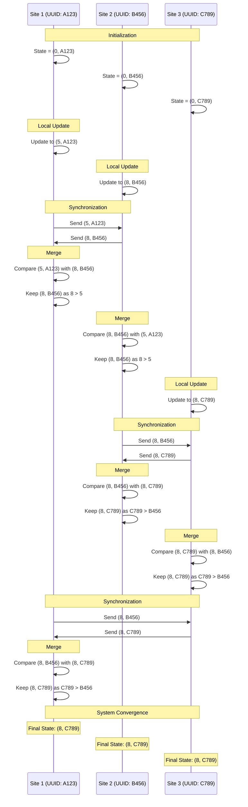

# FugueMax CRDT Algorithm Explanation

Yes, I'd be happy to explain the FugueMax CRDT algorithm step-by-step!

FugueMax is a Conflict-free Replicated Data Type (CRDT) algorithm designed for distributed systems to handle conflicts when multiple users make changes concurrently. It's specifically focused on maintaining the maximum value across replicas while handling network partitions and message delays.

## Core Concepts

1. **CRDT (Conflict-free Replicated Data Type)**: Data structures that can be replicated across multiple computers in a network, updated independently, and eventually reconciled automatically.

2. **FugueMax Approach**: Uses a pair of `(value, unique_id)` where:
   - `value` is the numerical value to track
   - `unique_id` is a site-generated unique identifier (often a UUID)

3. **Max Merge Rule**: When comparing two pairs, choose the one with the higher value, or if values are equal, the one with the lexicographically greater unique_id.

## Step-by-Step Algorithm Explanation

### 1. Initialization
- Each site initializes with a starting value (often 0) and generates a unique ID
- State = (0, site_unique_id)

### 2. Local Update
- When a site wants to update to a new value:
  - Create new pair (new_value, site_unique_id)
  - Compare with current state using max merge rule
  - Update local state if new pair is greater

### 3. Merge Operation
- When receiving updates from other sites:
  - Compare incoming state with local state using max merge rule
  - Keep the state with higher value (or higher unique_id if values are equal)

### 4. Convergence
- As sites exchange states, they all eventually converge to the same maximum value across the entire system

Let me provide a diagram to illustrate this:

## Key Advantages of FugueMax

1. **Strong Eventual Consistency**: All replicas converge to the same state after receiving the same set of updates, regardless of order.

2. **Conflict Resolution**: The algorithm automatically resolves conflicts without requiring manual intervention.

3. **Decentralized**: No central authority is needed, making it ideal for distributed systems.

4. **Fault Tolerance**: Continues to function even when some nodes are unreachable.

## Common Applications

- Distributed counters and gauges
- Distributed maximum-tracking systems
- Leader election in distributed systems
- Resource allocation in distributed environments

Would you like me to explain any particular aspect of the FugueMax algorithm in more detail?

